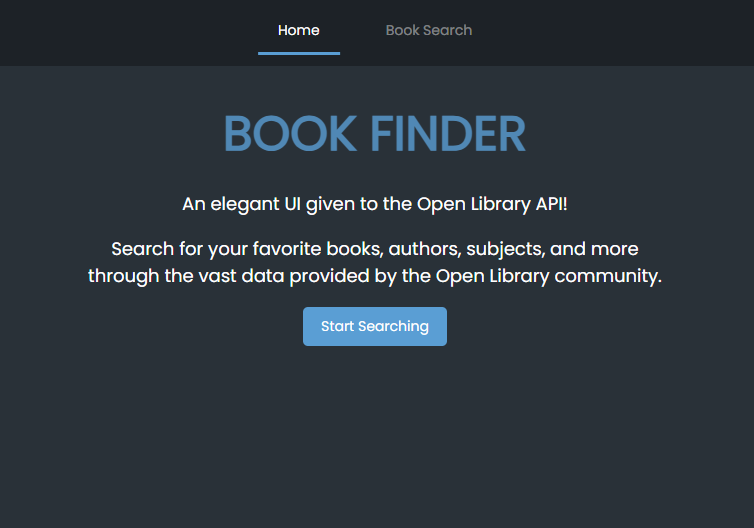
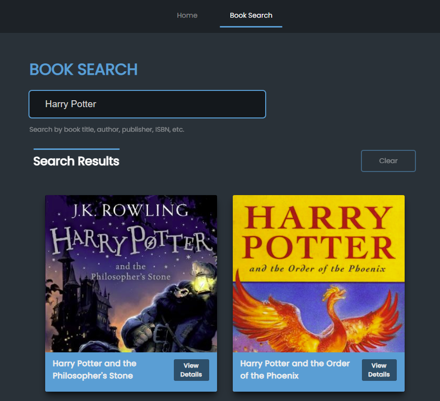
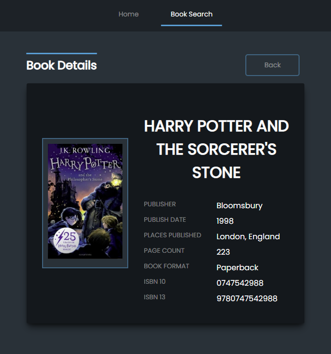

# Book Finder with React Router
>React app for searching books through the Open Library API

## The Home Page
Initial `Home` page:



## Book Search Page
Searching for a book through the `Book Search` page:



Viewing the book details by clicking on a book from the search results:



## App Usage

Install dependencies:
```
npm install
```

Run dev environment:
```
npm start
```
App will run on `http://localhost:3000`.

Build for production
```
npm run build
```